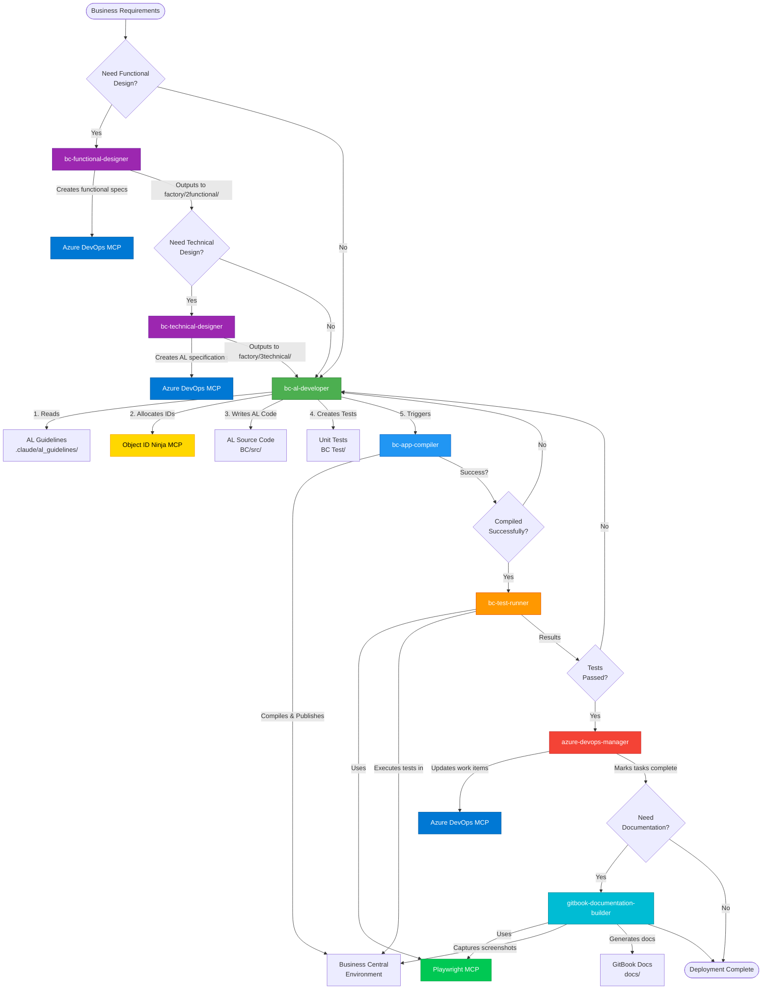

# Volt Factory

An AI-powered development framework for Microsoft Dynamics 365 Business Central, built on Claude Code with specialized MCP servers. Volt Factory provides complete automation from requirements gathering to production deployment, with enforced coding standards and comprehensive project management integration.

## What is Volt Factory?

Volt Factory is a comprehensive development ecosystem that transforms Business Central AL development through:

- **Specialized AI Agents** - 7 expert agents handling development, testing, design, and documentation
- **Enforced Quality Standards** - Mandatory AL coding guidelines and centralized object ID management
- **Complete Automation** - From business requirements to production deployment
- **Azure DevOps Integration** - Full work item tracking and project management
- **Cross-Platform Compilation** - Multi-app builds for Windows, Linux, and macOS
- **Automated Testing** - Browser-based test execution with Playwright
- **Product Documentation** - Automated GitBook documentation with screenshots

## Agent Workflow

The following diagram shows how Volt Factory's 7 specialized agents orchestrate a complete development cycle:



### Workflow Explanation

**Design Phase (Optional)**:
1. **bc-functional-designer** - Translates business requirements into functional specifications and creates Azure DevOps work items
2. **bc-technical-designer** - Converts functional specs into AL technical design with object definitions

**Development Phase (Core)**:
3. **bc-al-developer** - The primary developer agent:
   - Reads AL coding guidelines from `.claude/al_guidelines/`
   - Allocates object IDs via Object ID Ninja MCP (mandatory)
   - Writes AL code following all standards
   - Creates comprehensive unit tests
   - Triggers compilation

**Verification Phase**:
4. **bc-app-compiler** - Compiles and publishes to BC environment
   - If compilation fails → returns to bc-al-developer for fixes
5. **bc-test-runner** - Executes automated tests using Playwright
   - If tests fail → returns to bc-al-developer for fixes

**Completion Phase**:
6. **azure-devops-manager** - Updates all work items to mark tasks complete
7. **gitbook-documentation-builder** - Generates product documentation with screenshots (optional)

### Key Integration Points

- **Object ID Ninja MCP** - Enforces centralized ID allocation (mandatory for all new objects)
- **Azure DevOps MCP** - Maintains work item traceability throughout the workflow
- **Playwright MCP** - Powers both testing and documentation screenshot capture
- **Serena AL MCP** - Provides semantic code navigation (used by all agents for code analysis)

## Core Capabilities

### Development Workflow Automation
- **Requirements Analysis** → Functional Design → Technical Design → Implementation → Testing → Deployment
- **Intelligent Code Generation** - Context-aware AL code with proper patterns and best practices
- **Object ID Management** - Centralized allocation preventing conflicts
- **Unit Test Generation** - Comprehensive test coverage for all features
- **Real-Time Compilation** - Multi-app compilation with detailed error reporting

### Quality Enforcement
- **30+ AL Coding Guidelines** - Enforced formatting, naming, and structure rules
- **Design Patterns** - API patterns, command queue, facade, event bridge, and more
- **BCLinter Integration** - Project-specific linter rules
- **Mandatory ID Allocation** - No hardcoded object IDs allowed
- **Code Review Standards** - Consistent patterns across the codebase

### Project Management
- **Azure DevOps Integration** - Work items, epics, features, stories, tasks
- **Traceability** - Every code change linked to work items
- **Status Tracking** - Automated updates from development to deployment
- **Documentation Generation** - Product docs synced with implementation

## Architecture

### AI Agents

Volt Factory uses 7 specialized agents, each expert in their domain:

#### Development Agents

**1. [bc-al-developer](.claude/agents/bc-al-developer.md)**
- Primary AL code developer
- Reads and enforces all AL guidelines from [.claude/al_guidelines/](.claude/al_guidelines/)
- **Mandatory workflow**: Allocates object IDs before creating any AL object
- Creates comprehensive unit tests for all features
- Triggers compilation via bc-app-compiler agent
- Triggers testing via bc-test-runner agent
- Updates Azure DevOps work items via azure-devops-manager agent

**2. [bc-app-compiler](.claude/agents/bc-app-compiler.md)**
- Compilation and publishing specialist
- Multi-app discovery and compilation
- Cross-platform compiler management (Windows/Linux/macOS)
- Dev mode publishing (fast, 5-15 seconds)
- PTE mode publishing (production-ready, 2-5 minutes with monitoring)
- Real-time deployment status tracking

**3. [bc-test-runner](.claude/agents/bc-test-runner.md)**
- Automated testing orchestrator
- Browser-based test execution using Playwright MCP
- Automated test discovery and execution
- Detailed failure reporting with screenshots
- Integration with compilation workflow

#### Design Agents

**4. [bc-functional-designer](.claude/agents/bc-functional-designer.md)**
- Translates business requirements into BC functional specifications
- Creates Azure DevOps work items (user stories, tasks)
- Defines user workflows and acceptance criteria
- Outputs functional design documents to `factory/2functional/` directory

**5. [bc-technical-designer](.claude/agents/bc-technical-designer.md)**
- Converts functional design into AL technical specifications
- Defines tables, pages, codeunits, and object relationships
- Specifies field structures, validations, and business logic
- Creates technical tasks in Azure DevOps with AL object details
- Outputs technical design to `factory/3technical/` directory

#### Support Agents

**6. [azure-devops-manager](.claude/agents/azure-devops-manager.md)**
- Project management and work item orchestration
- Creates and manages Epic → Feature → Story → Task hierarchy
- Updates work item statuses based on development progress
- Links work items to code changes
- Applies tags and tracks deployment status

**7. [gitbook-documentation-builder](.claude/agents/gitbook-documentation-builder.md)**
- Automated product documentation
- Captures screenshots using Playwright
- Generates GitBook-compatible markdown
- Organizes documentation by modules and features
- Outputs to `docs/` directory with proper SUMMARY.md structure

### MCP Servers

Volt Factory integrates 6 MCP servers for specialized capabilities:

#### 1. Azure DevOps MCP
**Purpose**: Project management and work item tracking

**Installation**:
```bash
claude mcp add azureDevOps -s user \
  -e AZURE_DEVOPS_ORG_URL="https://dev.azure.com/YourOrg/" \
  -e AZURE_DEVOPS_AUTH_METHOD="pat" \
  -e AZURE_DEVOPS_PAT="your-personal-access-token" \
  -e AZURE_DEVOPS_DEFAULT_PROJECT="YourProject" \
  -- npx @tiberriver256/mcp-server-azure-devops
```

**Capabilities**:
- List/create/update work items
- Manage work item hierarchy
- Search work items, wikis, and code
- Link work items to code changes
- Track deployment status

#### 2. Object ID Ninja MCP
**Purpose**: Centralized AL object ID management

**Installation**:
```bash
claude mcp add objid @sshadows/objid-mcp --env MCP_MODE=lite
```

**Capabilities**:
- Reserve object IDs from managed pools
- Prevent ID conflicts across apps
- Track allocations in `.objidconfig`
- Support all AL object types (table, page, codeunit, report, etc.)
- Analyze workspace for ID usage and conflicts

**Configuration**: Pools defined in `BC/.objidconfig`

#### 3. Serena AL
**Purpose**: Semantic code navigation and analysis for AL

**Installation**:
```bash
claude mcp add serena -- uvx --from git+https://github.com/SShadowS/serena \
  serena start-mcp-server --context ide-assistant --project $(pwd)
```

**Capabilities**:
- Semantic symbol search and navigation
- Code structure analysis
- Smart editing by symbol (not just regex)
- Find references across codebase
- Symbol-based refactoring

**Configuration**: Project config in `.serena/project.yml`

#### 4. Playwright MCP
**Purpose**: Browser automation for testing and documentation

**Installation**:
```bash
claude mcp add playwright npx @playwright/mcp@latest --extension
```

**Setup**: Install [Playwright MCP browser extension](https://github.com/microsoft/playwright-mcp/releases) to connect to existing browser sessions.

**Capabilities**:
- Navigate BC web client
- Fill forms and click buttons
- Capture screenshots for documentation
- Verify UI behavior in tests
- Handle dialogs and popups

#### 5. Sequential Thinking
**Purpose**: Enhanced AI reasoning for complex multi-step tasks

**Installation**:
```bash
claude mcp add sequential-thinking -s local \
  -- npx -y @modelcontextprotocol/server-sequential-thinking
```

**Capabilities**:
- Break down complex problems
- Multi-step analysis with revision
- Hypothesis generation and verification
- Adaptive thinking process

#### 6. Microsoft Learn MCP
**Purpose**: Access to official Microsoft documentation

**Installation**:
```bash
claude mcp add --transport http microsoft_docs_mcp \
  https://learn.microsoft.com/api/mcp
```

**Capabilities**:
- Query Business Central documentation
- Retrieve AL language reference
- Access API documentation
- Get best practices from Microsoft

## Getting Started

### Prerequisites

- **Claude Code** - Installed and configured
- **Business Central Environment** - Sandbox or production access
- **Azure DevOps** - Project for work item tracking (optional but recommended)
- **Git** - Version control
- **Node.js** - For MCP servers
- **Python with uvx** - For Serena AL MCP

### Installation

**1. Clone the repository**:
```bash
git clone <repository-url> Volt-Factory
cd Volt-Factory
```

**2. Install MCP servers**:

Follow the installation commands in the [MCP Servers](#mcp-servers) section above. Install all 6 servers for full functionality.

**3. Configure environment**:
```bash
cp .env.example .env
# Edit .env with your settings
```

Key configuration in `.env`:
```bash
# Apps directory
BC_APPS_ROOT=BC

# Deployment type: online or local
BC_DEPLOYMENT_TYPE=online

# Environment: sandbox or production
BC_ENVIRONMENT_TYPE=sandbox

# OAuth credentials for online/SaaS
BC_TENANT_ID=your-tenant-id
BC_CLIENT_ID=your-app-client-id
BC_CLIENT_SECRET=your-app-secret

# Environment details
BC_ENVIRONMENT_NAME=Sandbox
BC_COMPANY_ID=your-company-id
```

**4. Configure Object ID pools**:

Create or edit `BC/.objidconfig`:
```json
{
  "pools": [
    {
      "id": "main",
      "from": 50100,
      "to": 50199,
      "description": "Main development range"
    }
  ]
}
```

**5. Verify setup**:
```bash
/bc_compile
```

This should discover and compile your BC apps.

## Usage

### Complete Feature Development

The typical workflow using Volt Factory agents:

**1. Provide Business Requirements**

Give requirements in natural language:
```
"Add a customer credit rating system. Customers should have a rating
from 1-5 stars. The rating affects credit limit approval workflow.
Include validation to prevent orders exceeding the customer's rating-based limit."
```

**2. Functional Design (Optional)**

If you want formal functional specs:
```
Launch bc-functional-designer agent with requirements
→ Creates functional design document
→ Creates user stories in Azure DevOps
→ Defines acceptance criteria
```

**3. Technical Design (Optional)**

If you want technical specifications before implementation:
```
Launch bc-technical-designer agent with functional design
→ Creates technical specification document
→ Defines AL objects (tables, pages, codeunits)
→ Creates technical tasks in Azure DevOps
```

**4. Implementation**

Launch bc-al-developer agent:
```
bc-al-developer reads:
→ AL guidelines from .claude/al_guidelines/
→ Azure DevOps work items (if available)
→ Existing codebase structure

bc-al-developer executes:
→ Allocates object IDs for all new objects (via mcp__objid__allocate_id)
→ Implements AL code following guidelines
→ Creates comprehensive unit tests
→ Invokes bc-app-compiler for compilation and publishing
→ Invokes bc-test-runner for test execution
→ Invokes azure-devops-manager to update work items
```

**5. Documentation (Optional)**

Launch gitbook-documentation-builder agent:
```
→ Generates user documentation with screenshots
→ Creates GitBook structure in docs/
→ Updates SUMMARY.md with new content
```

**Result**: Production-ready feature with code, tests, documentation, and full Azure DevOps traceability.

### Quick Development Workflows

**Compile all apps**:
```
/bc_compile
```

**Complete sandbox workflow** (compile + publish + verify):
```
/bc_workflow_sandbox
```

**Complete production workflow** (compile + validate + guide):
```
/bc_workflow_production
```

**Just publish to sandbox** (dev mode, fast):
```
/bc_publish_sandbox
```

**Publish to sandbox** (PTE mode, production-like):
```
/bc_publish_sandbox_pte
```

**Verify app installation**:
```
/bc_verify
```

### Using Workflow Prompts

The `prompts/` directory contains ready-to-use workflow prompts for different development scenarios. Each prompt is designed to be copied and pasted directly into Claude Code or given to a global agent.

**[prompts/README.md](prompts/README.md)** - Complete workflow guide with usage instructions

#### Available Workflow Scenarios

**1. [Full Workflow](prompts/01_full_workflow.md)** - Complete end-to-end development
- Business Requirement → Functional Design → Technical Design → Development → Testing → Documentation
- Use when starting from scratch with a business requirement

**2. [Business to Functional Design](prompts/02_business_to_functional_design.md)** - Design phase only
- Business Requirement → Functional Design ✋ (STOP)
- Use when you need functional specifications without proceeding to implementation

**3. [Functional to Technical Design](prompts/03_functional_to_technical_design.md)** - Technical specs only
- Existing Functional Design → Technical Design ✋ (STOP)
- Use when you have functional design and need detailed technical specifications

**4. [Functional to Completion](prompts/04_functional_to_completion.md)** - Complete from functional design
- Existing Functional Design → Technical Design → Development → Testing → Documentation
- Use when functional design is complete and you want full implementation

**5. [Development to Completion](prompts/05_development_to_completion.md)** - Implementation from technical specs
- Existing Technical Design → Development → Testing → Documentation
- Use when technical specifications are ready for development

**6. [Testing Only](prompts/06_testing_only.md)** - Test execution and iteration
- Existing Code (compiled) → Testing → (iteration loop if failures)
- Use when code is ready and you need to run and validate tests

**7. [Documentation Only](prompts/07_documentation_only.md)** - Generate user documentation
- Existing Feature (implemented & tested) → Documentation
- Use when features are complete and need end-user documentation

#### How to Use

1. **Choose the appropriate workflow** based on your starting point (see [prompts/README.md](prompts/README.md))
2. **Open the corresponding prompt file** (e.g., `prompts/03_functional_to_technical_design.md`)
3. **Copy the entire content** of the file
4. **Customize** the feature description to match your specific requirements
5. **Paste into Claude Code** or provide to your global agent
6. **Execute** and let the Volt-Factory agents handle the workflow

These templates ensure consistent, high-quality results and allow you to start from any point in the development lifecycle.

## Compilation & Publishing

### Multi-App Compilation

**How it works**:
1. Recursively discovers all `app.json` files in `BC_APPS_ROOT`
2. Compiles each app independently
3. Uses cross-platform AL compiler (auto-detected OS)
4. Outputs versioned `.app` files
5. Continues on errors (compiles all apps)
6. Provides detailed summary

**Via Claude Code**:
```
/bc_compile
```

**Via Command Line**:
```bash
bash scripts/compile.sh
```

**With custom parameters**:
```bash
bash scripts/compile.sh --appsroot "MyApps" --output "build"
```

### Publishing Modes

| Mode | Command | Speed | Environment | Use Case |
|------|---------|-------|-------------|----------|
| **Dev** | `/bc_publish_sandbox` | 5-15 sec | Sandbox only | Daily development |
| **PTE** | `/bc_publish_sandbox_pte` | 2-5 min | Sandbox/Prod | Pre-production testing |
| **Production** | `/bc_publish_production` | Manual | Production | Live deployments |

**Dev Mode**:
- Single API call to `/dev/apps`
- Immediate schema sync
- Perfect for rapid iteration
- Same as VS Code F5 debugging

**PTE Mode**:
- 4-step Microsoft workflow
- Async installation with monitoring
- Auto-fetches company ID
- Real-time status polling
- Production-ready process

**Production Mode**:
- Validation and safety checks
- Manual upload via BC Admin Center
- Guided deployment process
- Verification support

### Publishing Scripts

| Script | Purpose |
|--------|---------|
| `bc-publish-sandbox-dev.sh` | Dev mode publishing |
| `bc-publish-sandbox-pte.sh` | PTE mode with monitoring |
| `bc-publish-production-pte.sh` | Production validation |
| `bc-verify-app.sh` | Installation verification |
| `bc-auth.sh` | Authentication handler |
| `bc-config-validate.sh` | Config validation |

## AL Object ID Management

### Mandatory Allocation Workflow

**ENFORCED**: The bc-al-developer agent will NEVER create an AL object without first allocating an ID.

**Workflow**:

1. **Agent calls** `mcp__objid__allocate_id`:
   ```
   mode: "reserve"
   appPath: "C:\path\to\Volt-Factory\BC"
   object_type: "table"
   object_metadata: {
     name: "Customer Credit Rating",
     file: "src/CustomerCreditRating.Table.al"
   }
   ```

2. **MCP server allocates** ID from pool in `.objidconfig`

3. **Agent receives** allocated ID (e.g., 50100)

4. **Agent creates** AL object using allocated ID:
   ```al
   table 50100 "Customer Credit Rating"
   {
       DataClassification = CustomerContent;

       fields
       {
           field(1; "Customer No."; Code[20])
           {
               TableRelation = Customer;
           }
           field(2; Rating; Integer)
           {
               MinValue = 1;
               MaxValue = 5;
           }
       }
   }
   ```

### Supported Object Types

All AL object types are supported:
- `table`, `tableextension`
- `page`, `pageextension`
- `codeunit`
- `report`, `query`, `xmlport`
- `enum`, `enumextension`
- `controladdin`, `profile`
- `permissionset`, `permissionsetextension`

### Pool Configuration

Pools are defined in `BC/.objidconfig`:

```json
{
  "pools": [
    {
      "id": "main",
      "from": 50100,
      "to": 50199,
      "description": "Main objects"
    },
    {
      "id": "extensions",
      "from": 50200,
      "to": 50299,
      "description": "Extensions"
    }
  ]
}
```

## AL Coding Guidelines

All AL code must follow comprehensive guidelines in [.claude/al_guidelines/](.claude/al_guidelines/).

### Best Practices (30+ Guidelines)

Located in [.claude/al_guidelines/BestPractices/](.claude/al_guidelines/BestPractices/):

**Code Formatting**:
- [Blank lines](.claude/al_guidelines/BestPractices/blank-lines/)
- [Begin/end pairs](.claude/al_guidelines/BestPractices/begin-end/)
- [Keyword pair indentation](.claude/al_guidelines/BestPractices/keyword-pairs-indentation/)
- [Binary operators spacing](.claude/al_guidelines/BestPractices/spacing-binary-operators/)
- [One statement per line](.claude/al_guidelines/BestPractices/one-statement-per-line/)
- [Comments spacing](.claude/al_guidelines/BestPractices/comments-spacing/)

**Control Flow**:
- [If/else patterns](.claude/al_guidelines/BestPractices/separate-if-and-else/)
- [Unnecessary else](.claude/al_guidelines/BestPractices/unnecessary-else/)
- [Unnecessary true/false](.claude/al_guidelines/BestPractices/unnecessary-truefalse/)
- [Case actions](.claude/al_guidelines/BestPractices/case-actions/)
- [If not find then exit](.claude/al_guidelines/BestPractices/if-not-find-then-exit/)

**Performance**:
- [SetLoadFields](.claude/al_guidelines/BestPractices/SetLoadFields/)
- [DeleteAll optimization](.claude/al_guidelines/BestPractices/DeleteAll/)
- [IsTemporary safeguards](.claude/al_guidelines/BestPractices/istemporary-table-safeguard/)

**Code Quality**:
- [Variable naming](.claude/al_guidelines/BestPractices/variable-naming/)
- [Named invocations](.claude/al_guidelines/BestPractices/named-invocations/)
- [Variable declarations order](.claude/al_guidelines/BestPractices/variables-declarations-order/)
- [Suggested abbreviations](.claude/al_guidelines/BestPractices/suggested-abbreviations/)
- [Custom telemetry](.claude/al_guidelines/BestPractices/CustomTelemetry/)

### Design Patterns

Located in [.claude/al_guidelines/patterns/](.claude/al_guidelines/patterns/):

- [API Delegate Operations](.claude/al_guidelines/patterns/api-delegate-operation/) - Handle API requests
- [API Register Fieldset](.claude/al_guidelines/patterns/api-register-fieldset/) - API field management
- [Command Queue](.claude/al_guidelines/patterns/command-queue/) - Async command processing
- [Error Handling](.claude/al_guidelines/patterns/error-handling/) - Comprehensive error strategies
- [Event Bridge](.claude/al_guidelines/patterns/event-bridge-pattern/) - Decouple event publishers/subscribers
- [Facade Pattern](.claude/al_guidelines/patterns/facade-pattern/) - Simplify complex subsystems
- [Generic Method](.claude/al_guidelines/patterns/generic-method-pattern/) - Reusable generic procedures
- [Template Method](.claude/al_guidelines/patterns/template-method-pattern/) - Algorithm templates

### Project Standards

- **[Prefix Conventions](.claude/al_guidelines/prefix.md)** - Object and variable prefixes
- **[Naming Standards](.claude/al_guidelines/names.md)** - Naming conventions for all symbols
- **[BCLinter Rules](.claude/al_guidelines/bclintercop.md)** - Project-specific linter configuration
- **[Permission Sets](.claude/al_guidelines/permissionset.md)** - Permission management guidelines
- **[Object Creation](.claude/al_guidelines/objectcreation.md)** - Object creation patterns

**The bc-al-developer agent reads ALL guidelines before implementing any feature.**

## Available Slash Commands

All commands use `bc_` prefix for discoverability:

| Command | Description |
|---------|-------------|
| `/bc_compile` | Compile all BC apps in workspace |
| `/bc_publish_sandbox` | Publish to sandbox (dev mode) |
| `/bc_publish_sandbox_pte` | Publish to sandbox (PTE mode) |
| `/bc_publish_production` | Production deployment with validations |
| `/bc_verify` | Verify app installation status |
| `/bc_workflow_sandbox` | Complete sandbox workflow |
| `/bc_workflow_production` | Complete production workflow |
| `/bc_start_serena` | Start Serena UVX MCP server |

Commands are defined in [.claude/commands/](.claude/commands/).

## Repository Structure

```
Volt-Factory/
├── .env                              # Environment configuration
├── .env.example                      # Configuration template
├── README.md                         # This file
│
├── .claude/                          # Claude Code configuration
│   ├── agents/                       # AI agent definitions
│   │   ├── bc-al-developer.md
│   │   ├── bc-app-compiler.md
│   │   ├── bc-test-runner.md
│   │   ├── bc-functional-designer.md
│   │   ├── bc-technical-designer.md
│   │   ├── azure-devops-manager.md
│   │   └── gitbook-documentation-builder.md
│   │
│   ├── commands/                     # Slash commands
│   │   ├── bc_compile.md
│   │   ├── bc_publish_sandbox.md
│   │   ├── bc_publish_sandbox_pte.md
│   │   ├── bc_publish_production.md
│   │   ├── bc_verify.md
│   │   ├── bc_workflow_sandbox.md
│   │   ├── bc_workflow_production.md
│   │   └── bc_start_serena.md
│   │
│   └── al_guidelines/                # AL coding standards
│       ├── BestPractices/            # 30+ formatting and quality rules
│       │   ├── blank-lines/
│       │   ├── begin-end/
│       │   ├── SetLoadFields/
│       │   ├── DeleteAll/
│       │   ├── CustomTelemetry/
│       │   ├── variable-naming/
│       │   └── ... (30+ guidelines)
│       │
│       ├── patterns/                 # Design patterns
│       │   ├── api-delegate-operation/
│       │   ├── command-queue/
│       │   ├── event-bridge-pattern/
│       │   ├── facade-pattern/
│       │   └── ... (8 patterns)
│       │
│       ├── bclintercop.md            # Linter rules
│       ├── names.md                  # Naming conventions
│       ├── objectcreation.md         # Object creation patterns
│       ├── permissionset.md          # Permission guidelines
│       └── prefix.md                 # Prefix standards
│
├── BC/                               # Business Central apps
│   ├── app.json                      # App manifest
│   ├── .objidconfig                  # Object ID pool configuration
│   ├── src/                          # AL source code
│   │   └── *.al
│   └── .alpackages/                  # BC dependencies
│       └── Microsoft_*.app
│
├── BC Test/                          # Test apps (optional)
│   ├── app.json
│   ├── src/
│   │   └── *.Test.al
│   └── .alpackages/
│
├── scripts/                          # Build and publish scripts
│   ├── compile.sh                    # Multi-app compilation
│   ├── bc-auth.sh                    # Authentication handler
│   ├── bc-publish-sandbox-dev.sh     # Dev mode publishing
│   ├── bc-publish-sandbox-pte.sh     # PTE mode publishing
│   ├── bc-publish-production-pte.sh  # Production publishing
│   ├── bc-verify-app.sh              # Installation verification
│   ├── bc-config-validate.sh         # Config validation
│   ├── bc-extract-launch-config.sh   # launch.json extractor
│   │
│   └── compiler/                     # AL compiler (cross-platform)
│       └── extension/bin/
│           ├── win32/alc.exe         # Windows compiler
│           ├── linux/alc             # Linux compiler
│           └── darwin/alc            # macOS compiler
│
├── factory/                          # Design output directory
│   ├── 1research/                    # Business research output
│   ├── 2functional/                  # Functional design docs
│   └── 3technical/                   # Technical design docs
│
├── docs/                             # GitBook documentation output
│   ├── SUMMARY.md                    # GitBook table of contents
│   ├── Home/
│   └── Documentation/
│
├── prompts/                          # Workflow prompt templates
│   ├── README.md                     # Workflow guide and documentation
│   ├── 01_full_workflow.md           # Complete end-to-end workflow
│   ├── 02_business_to_functional_design.md    # Business → Functional design
│   ├── 03_functional_to_technical_design.md   # Functional → Technical design
│   ├── 04_functional_to_completion.md         # Functional design → Completion
│   ├── 05_development_to_completion.md        # Technical design → Completion
│   ├── 06_testing_only.md            # Testing workflow with iteration
│   └── 07_documentation_only.md      # Documentation generation
│
├── factory_docs/                     # Technical guides
│   ├── PUBLISHING.md                 # Publishing guide
│   ├── ENVIRONMENTS.md               # Environment configuration
│   └── AUTHENTICATION.md             # Authentication setup
│
└── .serena/                          # Serena MCP configuration
    └── project.yml                   # Project settings
```

## Authentication Setup

### Online/SaaS (OAuth 2.0)

**For Microsoft-hosted Business Central:**

1. **Create Azure AD App Registration**:
   - Go to Azure Portal → Azure Active Directory → App registrations
   - Create new registration
   - Note the Application (client) ID and Directory (tenant) ID

2. **Create client secret**:
   - Go to Certificates & secrets
   - Create new client secret
   - Copy the secret value

3. **Grant API permissions**:
   - Go to API permissions
   - Add permission: Dynamics 365 Business Central → `Automation.ReadWrite.All`
   - Grant admin consent

4. **Configure `.env`**:
   ```bash
   BC_DEPLOYMENT_TYPE=online
   BC_TENANT_ID=your-tenant-id
   BC_CLIENT_ID=your-client-id
   BC_CLIENT_SECRET=your-client-secret
   BC_ENVIRONMENT_NAME=Sandbox
   ```

### Local/Docker (Basic Auth)

**For on-premises or Docker BC:**

1. **Enable NavUserPassword** in BC Server configuration

2. **Create BC user** with appropriate permissions

3. **Configure `.env`**:
   ```bash
   BC_DEPLOYMENT_TYPE=local
   BC_LOCAL_USERNAME=your-username
   BC_LOCAL_PASSWORD=your-password
   BC_LOCAL_SERVER_URL=http://localhost:7048
   ```

See [factory_docs/AUTHENTICATION.md](factory_docs/AUTHENTICATION.md) for detailed setup.

## Documentation

### Technical Guides

- **[PUBLISHING.md](factory_docs/PUBLISHING.md)** - Complete publishing documentation
- **[ENVIRONMENTS.md](factory_docs/ENVIRONMENTS.md)** - Environment configuration guide
- **[AUTHENTICATION.md](factory_docs/AUTHENTICATION.md)** - OAuth and Basic Auth setup

### Agent Documentation

All agent documentation in [.claude/agents/](.claude/agents/):
- Each agent has detailed documentation in its `.md` file
- Describes responsibilities, tools, and workflows
- Includes examples of when to use each agent

### Command Documentation

All command documentation in [.claude/commands/](.claude/commands/):
- Each slash command has a complete `.md` file
- Explains what the command does
- Shows usage examples
- Documents expected outputs

## Platform Support

| Platform | Compiler | Status |
|----------|----------|--------|
| **Windows** | `scripts/compiler/extension/bin/win32/alc.exe` | ✅ Tested on Windows 10/11 |
| **Linux** | `scripts/compiler/extension/bin/linux/alc` | ✅ Tested on Ubuntu 20.04+ |
| **macOS** | `scripts/compiler/extension/bin/darwin/alc` | ✅ Tested on macOS 11+ |

## Troubleshooting

### Common Issues

**"No app.json files found"**
- Check `BC_APPS_ROOT` in `.env`
- Verify app folders contain `app.json`
- Ensure correct directory structure

**"Object ID allocation failed"**
- Verify `.objidconfig` exists in app folder
- Check pool configuration is valid JSON
- Ensure pool has available IDs

**"Compilation failed"**
- Check AL syntax errors in output
- Verify dependencies in `.alpackages/`
- Ensure BC version compatibility in `app.json`
- Check compiler has execute permissions (Linux/macOS)

**"Publishing failed"**
- Verify authentication credentials in `.env`
- Check network connectivity to BC environment
- Review API error messages for specific issues
- Ensure environment name matches exactly

**"Test execution failed"**
- Verify BC web client is accessible
- Check Playwright MCP is installed
- Ensure test codeunits are compiled and published
- Review browser console for JavaScript errors

### Getting Help

- Review agent documentation in [.claude/agents/](.claude/agents/)
- Check command documentation in [.claude/commands/](.claude/commands/)
- Review technical guides in [factory_docs/](factory_docs/)
- Check compilation/publishing output for detailed errors
- Verify MCP server installations

## Best Practices

### Development Workflow
- **Use agents for all development** - Don't bypass the workflow
- **Let bc-al-developer allocate IDs** - Never hardcode object IDs
- **Write comprehensive tests** - Every feature needs test coverage
- **Update Azure DevOps** - Maintain work item traceability
- **Follow AL guidelines** - The agents enforce these for consistency

### Version Control
- **Commit `.objidconfig`** - Track allocated IDs
- **Ignore `.app` files** - Already in `.gitignore`
- **Version `app.json` properly** - Increment versions on releases
- **Document breaking changes** - In commit messages and work items

### Code Quality
- **Read AL guidelines** - Located in [.claude/al_guidelines/](.claude/al_guidelines/)
- **Use descriptive names** - Follow naming conventions
- **Document complex logic** - Comments for maintainability
- **Implement error handling** - Follow error handling patterns
- **Consider performance** - Use SetLoadFields, avoid unnecessary queries

### Project Management
- **Maintain Azure DevOps** - Keep work items up to date
- **Link code to work items** - Ensure traceability
- **Use proper hierarchy** - Epic → Feature → Story → Task
- **Tag appropriately** - Use tags for organization and filtering

## Contributing

Contributions are welcome! Please:
- Follow the existing AL coding guidelines
- Use the agent workflow for changes
- Update documentation as needed
- Test thoroughly before submitting

## License

This repository is provided as-is for Business Central development purposes. The AL compiler belongs to Microsoft Corporation and is subject to their licensing terms.

## Acknowledgments

- **Microsoft** - AL Language compiler and Business Central platform
- **Anthropic** - Claude Code and AI capabilities
- **MCP Contributors** - Azure DevOps MCP, Object ID Ninja, Serena AL
- **Playwright Team** - Browser automation framework
- **Business Central Community** - Patterns, practices, and support

---

**Volt Factory** - Complete AI-powered automation for Business Central development

For questions or issues, please open an issue on the repository.
