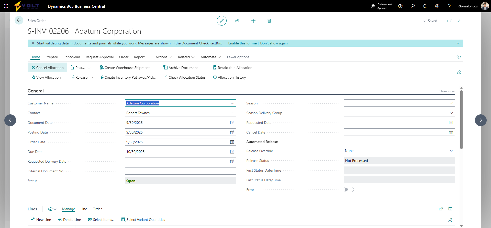

# Getting Started with Allocation Cancellation

## Overview

This guide explains how to access the Allocation Cancellation feature in Business Central and covers the prerequisites needed to use it effectively.

## Prerequisites

Before you can use the Allocation Cancellation feature, ensure the following requirements are met:

### System Requirements

1. **Business Central Version**: The Allocation Cancellation feature is implemented as a custom extension. Ensure it has been installed and published to your Business Central environment.

2. **License Requirements**: Your Business Central license must include:
   - Access to Sales Order and/or Purchase Order pages
   - Permissions to view and modify reservation entries

### User Permissions

Your user account must have the following permissions:

**Sales Order Allocation Cancellation:**
- Read access to Sales Header and Sales Line tables
- Modify access to Sales Line table (field 50100-50103)
- Read, Insert, Modify, Delete access to Reservation Entry table
- Read and Insert access to VT Allocation Cancel History table
- Read access to Reason Code table

**Purchase Order Allocation Cancellation:**
- Read access to Purchase Header and Purchase Line tables
- Modify access to Purchase Line table (field 50100-50103)
- Read, Insert, Modify, Delete access to Reservation Entry table
- Read and Insert access to VT Allocation Cancel History table
- Read access to Reason Code table

**History Viewing:**
- Read access to VT Allocation Cancel History table

Note: Consult your Business Central administrator or system owner to verify your user permissions.

### Business Process Requirements

1. **Reason Codes Configured**: While the system can function without preconfigured reason codes, it is strongly recommended to set up specific reason codes for allocation cancellations. This improves audit trails and reporting capabilities.

   **To configure reason codes:**
   - Navigate to **Search** (Alt+Q) > type "Reason Codes" > open **Reason Codes** page
   - Create codes such as:
     - `ALLOC-CANCEL`: General allocation cancellation
     - `ALLOC-REALLOC`: Reallocating to different order
     - `ALLOC-PRIORITY`: Higher priority order requirement
     - `ALLOC-CUSTCHG`: Customer requested change
     - `CANCEL-ORDER`: Order cancelled by customer

2. **Understanding of Reservations**: Users should be familiar with how Business Central handles inventory reservations. Review the standard reservation functionality before using allocation cancellation.

## Accessing the Feature

The Allocation Cancellation feature is accessible from multiple locations within Business Central, depending on your workflow.

### Option 1: From Sales Orders

1. Open a sales order:
   - Press **Alt+Q** to open Search
   - Type "Sales Orders" and press Enter
   - Select the desired sales order from the list

2. On the Sales Order page, you will see new actions in the ribbon:
   - **Cancel Allocation**: Located in the Actions ribbon under Functions group
   - **Allocation History**: View cancellation history for the current document

   
   *The Cancel Allocation button appears in the action ribbon on Sales Order pages*

3. The **Cancel Allocation** button is enabled only when:
   - The document status is "Open"
   - One or more lines have active reservations

### Option 2: From Purchase Orders

1. Open a purchase order:
   - Press **Alt+Q** to open Search
   - Type "Purchase Orders" and press Enter
   - Select the desired purchase order from the list

2. On the Purchase Order page, you will see new actions in the ribbon:
   - **Cancel Allocation**: Located in the Actions ribbon under Functions group
   - **Allocation History**: View cancellation history for the current document

3. The **Cancel Allocation** button is enabled only when:
   - The document status is "Open"
   - One or more lines have active reservations

### Option 3: Viewing Cancellation History Globally

To view all allocation cancellation history across all documents:

1. Press **Alt+Q** to open Search
2. Type "Allocation Cancellation History"
3. Open the **Allocation Cancellation History** page

This provides a complete list of all allocation cancellations in the system, with filtering and search capabilities.

## Understanding the User Interface

### Sales Order Page Enhancements

When you open a Sales Order, you will notice these additions:

**Actions Ribbon:**
- **Cancel Allocation** button: Appears in the Functions group, promoted to the Actions ribbon for quick access
- **Allocation History** button: Opens a filtered view of cancellation history for the current document

**Order Lines:**
- **Allocation Status** field: Displays "Active" or "Cancelled" for each line
  - Cancelled status appears with distinct styling (subordinate/gray)
  - Located after the "Reserved Quantity" field

### Purchase Order Page Enhancements

When you open a Purchase Order, you will notice these additions:

**Actions Ribbon:**
- **Cancel Allocation** button: Appears in the Functions group, promoted to the Actions ribbon for quick access
- **Allocation History** button: Opens a filtered view of cancellation history for the current document

**Order Lines:**
The Allocation Status field is available in the data model but may not be visible in the default subform view. Use the personalization features to add it if needed.

### Allocation Cancellation History Page

The history page displays cancellations in a list view with the following key columns:

- **Entry No.**: Unique identifier for each cancellation record
- **Cancellation Date**: Date the cancellation occurred
- **Document Type**: Order, Quote, etc.
- **Document No.**: Source document number (clickable to navigate to document)
- **Line No.**: Line number on source document
- **Item No.**: Item that was allocated
- **Location Code**: Warehouse location of the allocation
- **Quantity Cancelled**: Amount of inventory released
- **Customer/Vendor No.**: Trading partner associated with the order
- **Customer/Vendor Name**: Name of the trading partner
- **Cancelled By User ID**: User who performed the cancellation
- **Cancellation Reason Code**: Business reason for the cancellation

**Available Actions:**
- **Navigate to Document**: Opens the source sales or purchase order
- **Show Item**: Opens the item card for the cancelled item
- **Export to Excel**: Exports the history data to Excel for external analysis

## Verifying Installation

To confirm that the Allocation Cancellation feature is properly installed:

1. Open any Sales Order in "Open" status
2. Look for the **Cancel Allocation** and **Allocation History** buttons in the Actions ribbon
3. If these buttons are not visible:
   - Verify the extension has been published to your environment
   - Check your user permissions
   - Contact your Business Central administrator

Alternatively:

1. Press **Alt+Q** to open Search
2. Type "Allocation Cancellation History"
3. If the page appears in search results, the feature is installed

## Initial Setup Recommendations

Before actively using the feature, complete these recommended setup steps:

### 1. Configure Reason Codes

Create specific reason codes for allocation cancellations to improve reporting and audit capabilities:

1. Navigate to **Reason Codes** page (Alt+Q > "Reason Codes")
2. Create 3-5 reason codes that match your business scenarios
3. Use clear, descriptive codes and descriptions
4. Consider codes like:
   - Customer-requested changes
   - Reallocation to priority orders
   - Order cancellations
   - Inventory shortage adjustments
   - Supply chain disruptions

### 2. Define User Permissions

Work with your administrator to ensure appropriate users have the required permissions:

- Limit allocation cancellation rights to supervisors or managers if needed
- Grant read-only history access to auditors and reporting users
- Test permissions with each user role to verify proper access

### 3. Communicate Process Changes

Inform relevant staff members about the new capability:

- Train users on when and how to use allocation cancellation
- Document your organization's policies for requiring reason codes
- Establish escalation procedures for cancellation requests
- Create internal guidelines for selecting appropriate reason codes

### 4. Test in a Sandbox Environment (Recommended)

Before using in production:

1. Create test sales and purchase orders with reservations
2. Practice cancelling allocations with various scenarios
3. Verify history records are created correctly
4. Test the export to Excel functionality
5. Confirm navigation from history back to source documents works

## Common First-Time Questions

**Q: What happens to the inventory when I cancel an allocation?**
A: The inventory is released from the specific order and becomes available for reservation on other orders. The physical inventory quantity does not change; only the reservation link is removed.

**Q: Can I undo an allocation cancellation?**
A: No, cancellations are permanent. However, you can create a new reservation on the same order line using the standard Business Central reservation function. The original cancellation will remain in the history.

**Q: Do I need to select a reason code every time?**
A: Yes, the system will prompt you to select a reason code before processing the cancellation. This is mandatory for audit trail purposes.

**Q: What if I cancel an allocation by mistake?**
A: You can immediately recreate the reservation using the standard "Reserve" function on the order line. The cancellation will remain in the history for audit purposes.

**Q: Can I cancel allocations on released orders?**
A: No, the document must be in "Open" status. If you need to cancel allocations on a released order, you must first reopen the order using the "Reopen" action.

**Q: Will cancelling an allocation affect my posted shipments or receipts?**
A: No, you cannot cancel allocations on lines that have already been partially or fully shipped or received. The cancellation only affects future shipments/receipts.

## Next Steps

Now that you understand how to access the feature, proceed to the workflow guides:

- **[Cancel Sales Order Allocations](cancel-sales-order-allocation.md)**: Detailed steps for cancelling sales order reservations
- **[Cancel Purchase Order Allocations](cancel-purchase-order-allocation.md)**: Detailed steps for cancelling purchase order reservations
- **[View Cancellation History](view-cancellation-history.md)**: Learn how to review and analyze history records
